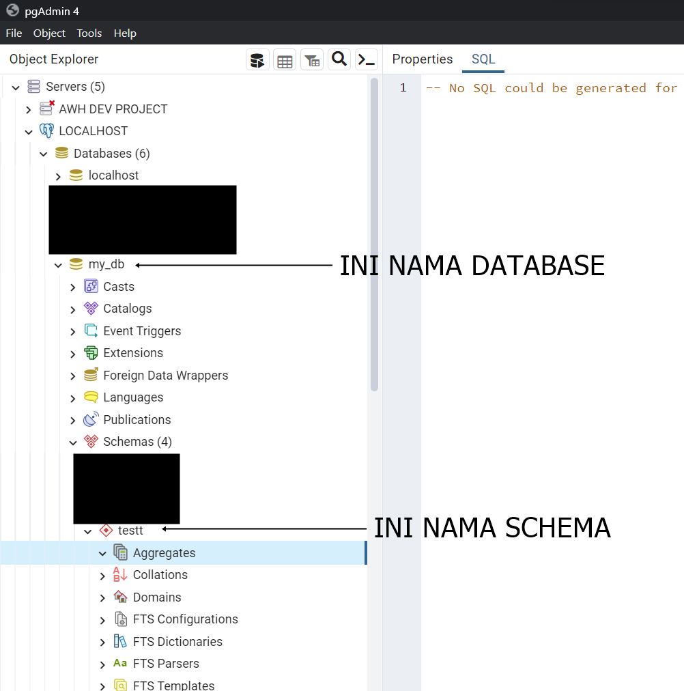

# Codeigniter 4 Dhiva

Custom APP Codeigniter 4

## Requitment

PHP Versi :

    PHP 7.4 keatas

php.ini extension :

    extension=intl
    extension=php_gmp
    extension=php_pgsql
    extension=php_pdo_pgsql
    extension=php_sockets
    extension=gd
    extension=zip

## Features

- Pembuatan Controller dan Model secara otomatis
- CMD environment
- APP ID Generate
- Coffee Maker

## Setup Database

- Buat terlebih dahulu database untuk project yang ingin dibangun
- Jika menggunakan `Postgre`
Tentukan `Username`, `Password`,`Database`, dan `Schema`
- Jika menggunakan `Mysql`
Tentukan  `Username`, `Password`, dan `Database`

## Run Locally

Kloning project

```bash
  git clone git@bitbucket.org:adhivasindo-prodev/base-ci4.git
```

Pindah ke Folder

```bash
  cd base-ci4
```

Update dependensi

```bash
  composer update
```
<br><hr><br>
### Inisialisasi Core 
<b>(Berlaku di sisi server dan developer)</b>



Jalankan perintah ini di CMD
```bash
  php spark sebat kuy
```

Disini perlu menentukan database yang ingin di gunakan
```
Database Driver 
  [0]  MySQLi
  [1]  Postgre
```

Jika memilih tipe `Postgre`  maka akan keluar tampilan seperti ini

```
Username Database :   
Password Database :
Nama Database:
Schema Database :
```

Untuk contohnya pengisiannya seperti di bawah ini:
```
Username Database : postgres   
Password Database : admin
Nama Database: my_db
Schema Database : testt
```
<br><hr><br>
#### Buatkan CRUD

Untuk membuat CRUD otomatis ketik `2` lalu akan muncul tampilan seperti ini

```
Nama Component  : 
Nama Routing    :
Tabel Database  :
```

List Perintah
------------

Jalankan perintah `php spark sebat` maka akan keluar tampilan seperti ini:

```
Perintahmu ya Baginda?
  [0]  Ubah environment ke production
  [1]  Buatkan APP ID
  [2]  Buatkan CRUD
  [3]  Buatkan Kopi
  [4]  Belum kepikiran ntar dulu
```

#### Ubah environment ke production

Jika ingin merubah environment dari development ke production atau sebaliknya ketik `0` maka akan keluar tampilan seperti ini

```bash
Berhasil dirubah ke development ya baginda
```

#### Buatkan APP ID
`APP ID` berfungsi untuk enkripsi data `Authorization` untuk menjadikan `ClientSecret` yang bertujuan untuk mencegah manipulasi `JWT Token` yang di simpan di sisi client

Untuk membuat `APP ID` ketik `1` lalu akan muncul seperti ini 

```
Berhasil ditambahkan APP ID ya baginda
```
Jika APP ID sudah tersedia maka akan muncul tampilan seperti ini

```
APP ID Sudah ada ya banginda, tidak perlu di generate lagi
```

#### Buatkan CRUD

Untuk membuat CRUD otomatis ketik `2` lalu akan muncul tampilan seperti ini

```
Nama Component  : 
Nama Routing    :
Tabel Database  :
```

##### Nama Component
Berfungsi untuk membuat file Controller dan Model, Misal untuk membuat Controller `EndpointController` dan Model `EndpointModelSql` hanya dibutuhkan input `endpoint` saja.

Contoh : 

```
Nama Component  : endpoint
```

##### Nama Routing
Berfungsi untuk membuat Routing URI dengan fitur CRUD secara otomatis

Contoh : 

```
Nama Routing  : endpoint
```

##### Tabel Database
Berfungsi untuk menentukan table yang ingin di CRUD kan

Contoh : 

```
Tabel Database  : endpoint
```
